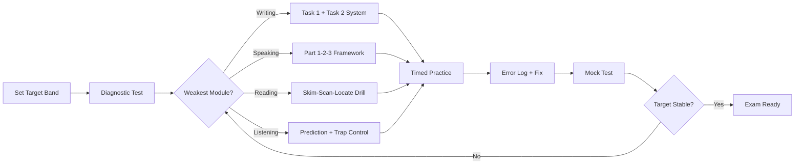
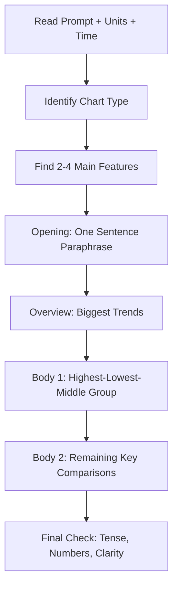
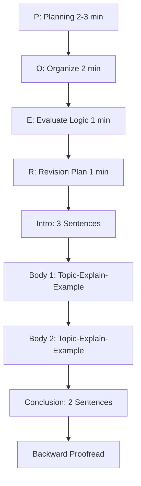
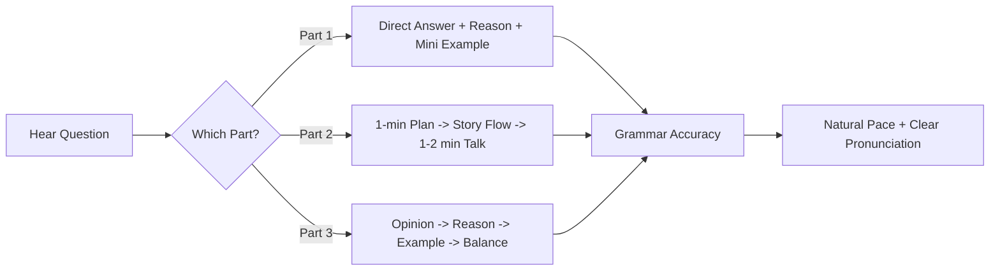
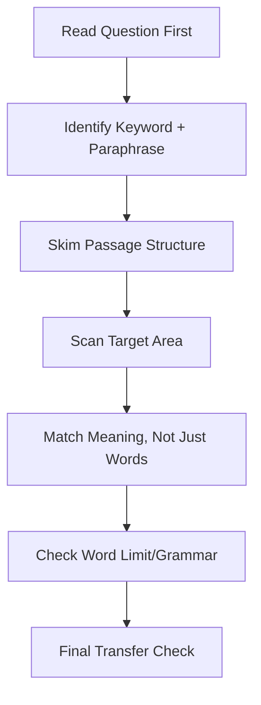
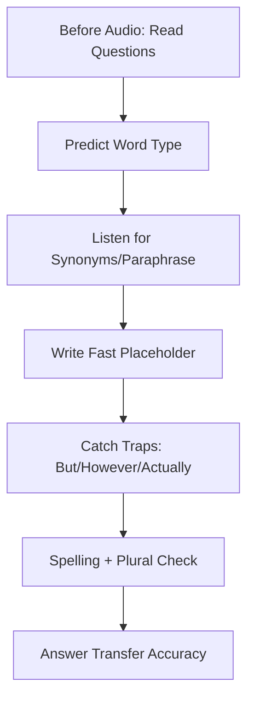
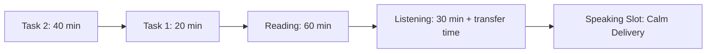

---
aliases:
  - IELTS Application Flowcharts
  - IELTS Visual Revision Maps
tags:
  - '#ielts/application'
  - '#ielts/strategy'
  - '#flowcharts'
status: active
author: Afnan Ahmed
---

# IELTS Application Flowcharts

## Why This Note
Use these flowcharts for fast revision before practice tests and exam day.

## 1) Full IELTS Prep Pipeline

## 2) Writing Task 1 Report Builder

## 3) Writing Task 2 Essay Builder (POER)

## 4) Speaking Flow (Part 1, 2, 3)

## 5) Reading Answer Flow

## 6) Listening Safety Flow

## 7) Exam-Day Time Map

## How to Use
1. Read one flowchart before each practice session.
2. Follow it while writing or speaking.
3. Mark the step where you failed.
4. Drill only that step for 2-3 days.

## Cross-Links
- [[IELTS_Writing_Task_1_Academic_Beginners_Guide]]
- [[IELTS_Writing_Task_2_Master_Guide]]
- [[IELTS_Speaking_Master_Guide]]
- [[IELTS_Reading_Master_Guide]]
- [[IELTS_Listening_Master_Guide]]

